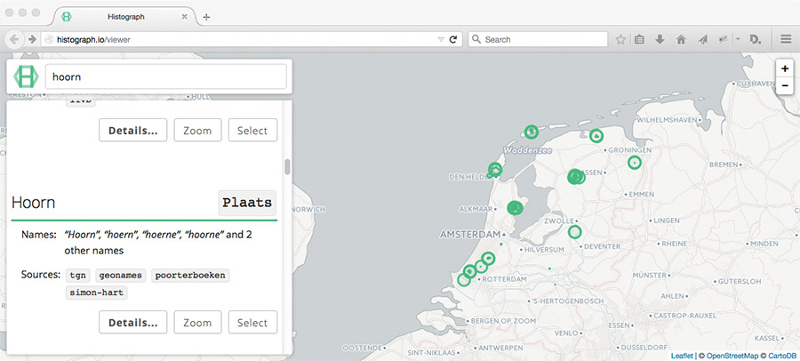

# Histograph Viewer

[http://histograph.io/viewer](http://histograph.io/viewer)

Web viewer for [Histograph](http://histograph.io) API & data, made with [React](https://facebook.github.io/react/). To run, type

    npm install
    npm start

The viewer is now running on [http://localhost:3000](http://localhost:3000).

## License

The source for Histograph is released under the GNU General Public License as published by the Free Software Foundation, either version 3 of the License, or (at your option) any later version.
